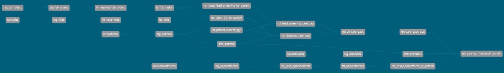

# Healthcare Analytics Engineering Platform

## Overview

This project demonstrates the design and implementation of a healthcare analytics platform using **dbt Core**, **Snowflake**, and **SQL** following modern Analytics Engineering best practices.

The goal of this project is to transform raw healthcare data into trusted business-ready datasets that support patient care gap reporting, clinical outreach, and operational analytics.

The project follows a layered data modeling approach that separates data ingestion, business transformations, dimensional modeling, and reporting into reusable components.

---

# Architecture

```
Sources
    ↓
Staging
    ↓
Intermediate
    ↓
Facts & Dimensions
    ↓
Reporting
```

---

# Technologies

* dbt Core
* Snowflake
* SQL
* Git
* GitHub

---

# Data Models

### Sources

* Patients
* Providers
* Visits
* Appointments
* Laboratory Orders

### Staging

Standardizes source data through:

* Data type conversions
* Column renaming
* Data cleaning
* Source normalization

### Intermediate

Implements reusable business logic including:

* Current patient age
* Valid patient visits
* Business rule transformations

### Marts

Dimensional models include:

* Patient Dimension
* Provider Dimension
* Visit Fact
* Appointment Fact
* Laboratory Fact

### Reporting

Business-ready reporting models include:

* Latest A1C by Patient
* Latest Lead Screening by Patient
* Diabetes Care Gap
* Lead Screening Care Gap
* All Care Gaps
* Care Gaps Due
* Next Appointment by Patient
* Care Gap Outreach Worklist

---

# Project Highlights

* Built using a layered Analytics Engineering architecture
* Modular SQL models using dbt `ref()` dependencies
* Dimensional modeling with fact and dimension tables
* Reusable business logic through intermediate models
* Data quality testing using dbt
* Automated documentation with dbt Docs
* End-to-end model lineage visualization
* Git version control and GitHub repository management

---

# dbt Lineage

The project includes fully documented model lineage generated using **dbt Docs**.



The lineage graph demonstrates how raw healthcare data flows through staging, intermediate transformations, dimensional models, and reporting models to produce business-ready clinical outreach datasets.

---

# Business Use Case

This project models a healthcare analytics workflow for identifying patients who require preventive care outreach.

Reporting outputs include:

* Diabetes A1C Care Gap
* Lead Screening Care Gap
* Care Gaps Due
* Care Gap Outreach Worklist

These datasets support care management teams by identifying patients who require follow-up and enriching those records with upcoming appointment information.

---

# Repository Structure

```
models/
├── staging/
├── intermediate/
├── marts/
└── reporting/

macros/
tests/
images/
```
